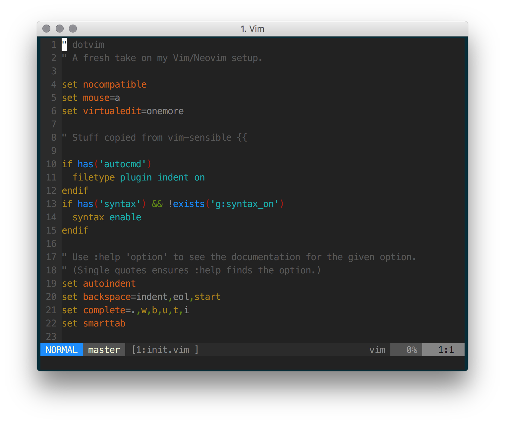

dotvim
======

A relatively barebones Vim setup.

# Features

  * **Clean**. Nothing (well, almost nothing) is in this setup that I don't use
    regularly.
  * **Standalone**. You shouldn't need to worry about where you put these
    files - just that you properly use `init.vim` as your vimrc file. We figure
    out the rest.
    * You could even have multiple copies laying around! All plugins get
      installed into a subdirectory of this repo.

# Should I use this myself?

If you want to, I guess...

# How do I get started?

 1. Clone this repository.
 2. Either link `init.vim` as your `.vimrc`
    (`ln -sf $PWD/dotvim/init.vim ~/.vimrc`), or try it out with
    `vim -u dotvim/init.vim`
 3. That's it!
    * You _may_ need to run `:PlugInstall`. This should happen automatically
      though.

# What does it look like?

# TODOs

  * This setup is almost standalone (see [Features](#features)), but it still
    downloads `vim-plug` into `~/.vim/autoload`. Consider adding a subdirectory
    (`runtime` perhaps) to clone that into, and add that to `runtimepath`.
